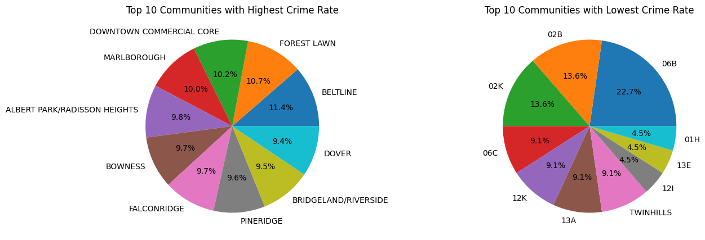
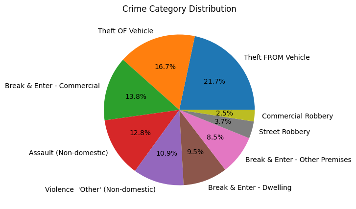
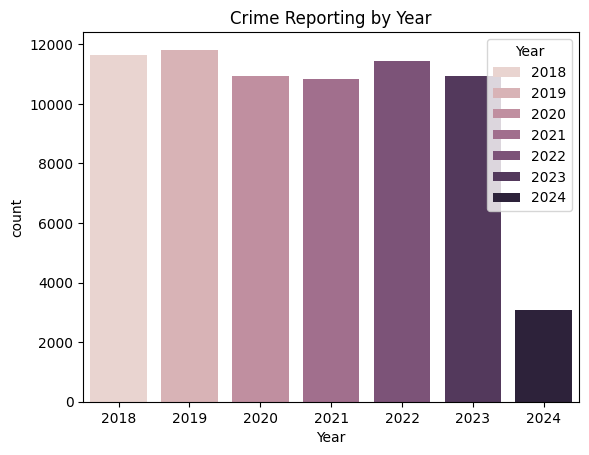
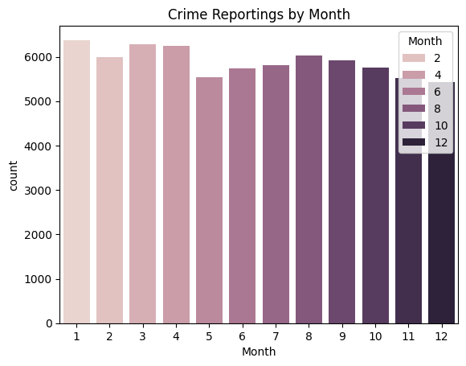
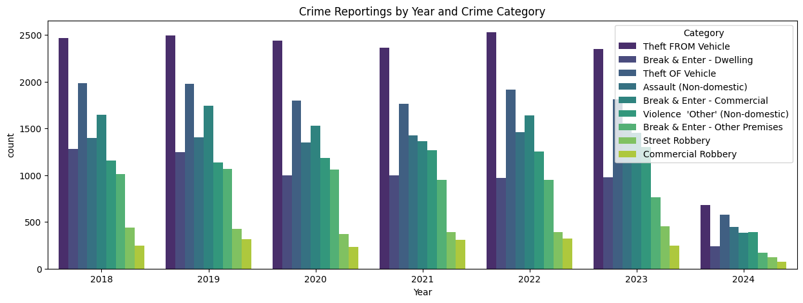
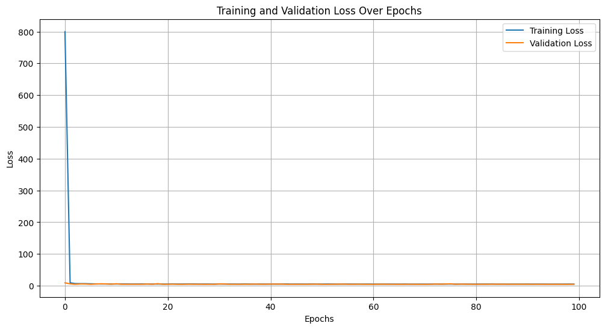
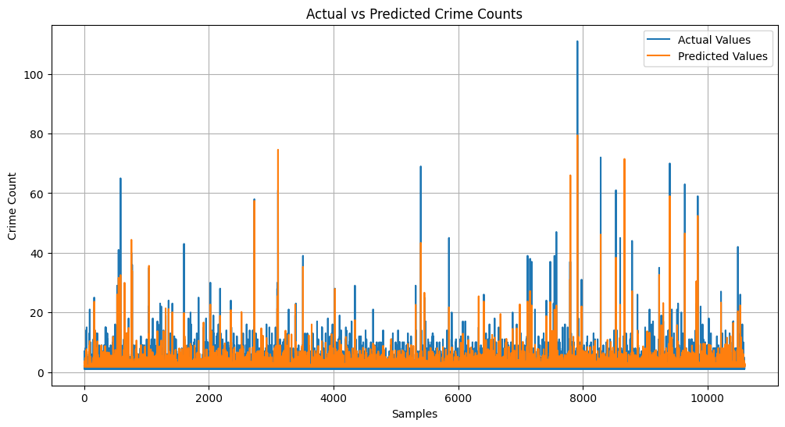

<p align="center">
  
</p>

# Calgary Crime Data Analysis and LSTM Prediction

I wanted to do two things with Calgary's public crime data. First, find out what the data says: which communities and which types of crime show up the most, and how that changes over the years and months. Second, build a neural network (an LSTM) that predicts the crime count.

The data comes from the City of Calgary's open data portal and covers community-level crime from January 2018 to about April 2024. After exploring it, I trained an LSTM that reached a test mean squared error of 4.82, which is roughly 2.2 crimes off on a typical row.

I'll be honest about the second half, though. The way I fed data to the LSTM doesn't really make it a forecasting model, and I explain why in the last section. The exploratory part is more solid, but I also found a mistake in how I counted crimes there.

The longer write-up is in [REPORT.pdf](REPORT.pdf) and all of the code is in `crime_data_analysis_and_neural_networks_final.ipynb`.

## Dataset

Source: Community Crime Statistics, from the [City of Calgary Open Data portal](https://data.calgary.ca) (the file I used is `Community_Crime_Statistics_20240522.csv`). It has 70,661 rows and 5 columns, and no missing values.

| Column | What it is |
| --- | --- |
| Community | Community code or name |
| Category | Type of crime (9 categories) |
| Crime Count | Number of crimes in that community, category and month |
| Year | 2018 to 2024 |
| Month | 1 to 12 |

Each row is one community, one crime category, one month. The count is small: the median is 2, the mean is 2.86 and the maximum is 111. The smallest value is 1, so months with no crimes aren't in the file at all.

The nine categories are Theft FROM Vehicle, Theft OF Vehicle, Break & Enter (Commercial, Dwelling and Other Premises), Assault (Non-domestic), Violence "Other" (Non-domestic), Street Robbery and Commercial Robbery.

## What I found in the data

These percentages count **rows** (community, category and month combinations that had at least one crime), not the sum of the crime counts. I didn't realise this until after I'd written the analysis, so treat them as a rough picture of how often each thing appears, not an exact share of all crimes.

- **Category:** Theft FROM Vehicle is the most common (21.7%), then Theft OF Vehicle (16.7%) and Break & Enter, Commercial (13.8%). Commercial Robbery (2.5%) and Street Robbery (3.7%) are the least common.
- **Community:** Beltline (11.4% of the top ten), Forest Lawn (10.7%) and Downtown Commercial Core (10.2%) lead the list. The top ten are all fairly close to each other, between about 9% and 11%.
- **Year:** The number of records is steady between about 10,800 and 11,800 a year from 2018 to 2023. 2024 is much lower because the data stops in spring.
- **Month:** January has the most records (about 6,400). May and the last two months of the year are the lowest, at roughly 5,500 to 5,600, so the differences are small.

<p align="center">
  
</p>

<p align="center">
  
  
  
</p>

<p align="center">
  
</p>

## How the model works

1. Label-encode `Community` and `Category` (turn the text into numbers).
2. Build sequences: take 3 consecutive rows (all 5 columns) as the input, and the `Crime Count` of the next row as the target. That gives 70,658 sequences.
3. Split them at random: 70% train (49,460), 15% validation (10,599), 15% test (10,599).
4. Train an LSTM with 50 units, `relu` activation, 20% dropout and a single output neuron. Adam optimiser, learning rate 0.001, MSE loss, 100 epochs, batch size 16.

## Results

| | Value |
| --- | --- |
| Test MSE | 4.82 |
| Test RMSE | about 2.20 crimes |
| Final validation loss | about 4.6 to 4.9 |
| Epochs | 100 |

For context, if I just predicted the average count every time, the MSE would be roughly the variance of the counts, about 13.4. So the model is much better than that, but I didn't check it against smarter baselines, like predicting the previous row's count.

<p align="center">
  
  
</p>

The loss curve starts at about 800 and drops to single digits after the first epoch, because I never scaled the inputs or the target. After that it's flat. The model follows the big spikes in the test set reasonably well, but that plot is over shuffled samples, so it isn't a time series.

<details>
<summary><b>Running it</b> (click to expand)</summary>

You need Python 3.9+ and:

```
pip install pandas numpy matplotlib seaborn scikit-learn tensorflow jupyter
```

The notebook was written in Google Colab and loads the data from Google Drive:

```python
df = pd.read_csv('./drive/MyDrive/Community_Crime_Statistics_20240522.csv')
```

To run it locally, delete the `drive.mount` cell and change the path to `pd.read_csv('Community_Crime_Statistics_20240522.csv')`.

Training takes about 15 to 25 seconds per epoch on Colab, so around 30 minutes for all 100 epochs. You can lower `epochs` to try it quickly.

Recent versions of Keras print a warning about passing `input_shape` to the first layer. It still works.

</details>

## Things I'd fix or try next

- **The sequences aren't in time order.** The file is sorted by community (and then category), not by date, so 3 consecutive rows are usually 3 different months or years of the same community and category, not 3 months in a row. And the rows I looked at seem to be ordered by crime count within each group, which would make "the next row's count" easy to guess from the previous one. So the 4.82 isn't evidence that the model can forecast anything. To do it properly I'd sort by date, build one monthly series per community and category (filling the missing months with 0), and predict the following month.
- **Random split of overlapping windows.** Sequences that overlap ended up in training, validation and test at the same time. A time-based split (train on earlier years, test on the latest) is the fair way.
- **I never predicted the future.** The goal in the notebook says "predict the number of crimes that will occur in the future", and the strategy lists "optimizing the model", but I didn't tune anything or produce a single future prediction.
- **Counting rows instead of crimes.** The pie charts and bar charts count rows. I should have summed `Crime Count` instead.
- **Zero months are missing.** Because no row has a count of 0, the data is sparse, and any trend based on row counts mixes real changes with months where nothing was reported.
- **Scaling and encoding.** The inputs aren't scaled, and the label-encoded community and category are treated like ordinary numbers. Embedding layers or one-hot encoding would be better.
- **Mistakes in my notebook text.** It names 13M as the safest community with 22.7%, but the chart shows 06B. It says 2022 had more records than 2018, but the bars show 2018 a little higher. The communities in the "lowest" pie chart have only a handful of records each, so I'd be careful calling them the "safest".
- **Metrics.** I only looked at MSE. MAE and a comparison with simple baselines would make the result much easier to understand.

## Files

```
.
├── assets/                                                  # banner and plots used in this README
├── crime_data_analysis_and_neural_networks_final.ipynb      # the whole analysis
├── Community_Crime_Statistics_20240522.csv                  # data (City of Calgary open data)
├── REPORT.pdf                                               # longer write-up
└── README.md
```

## Author

Yash Jain
